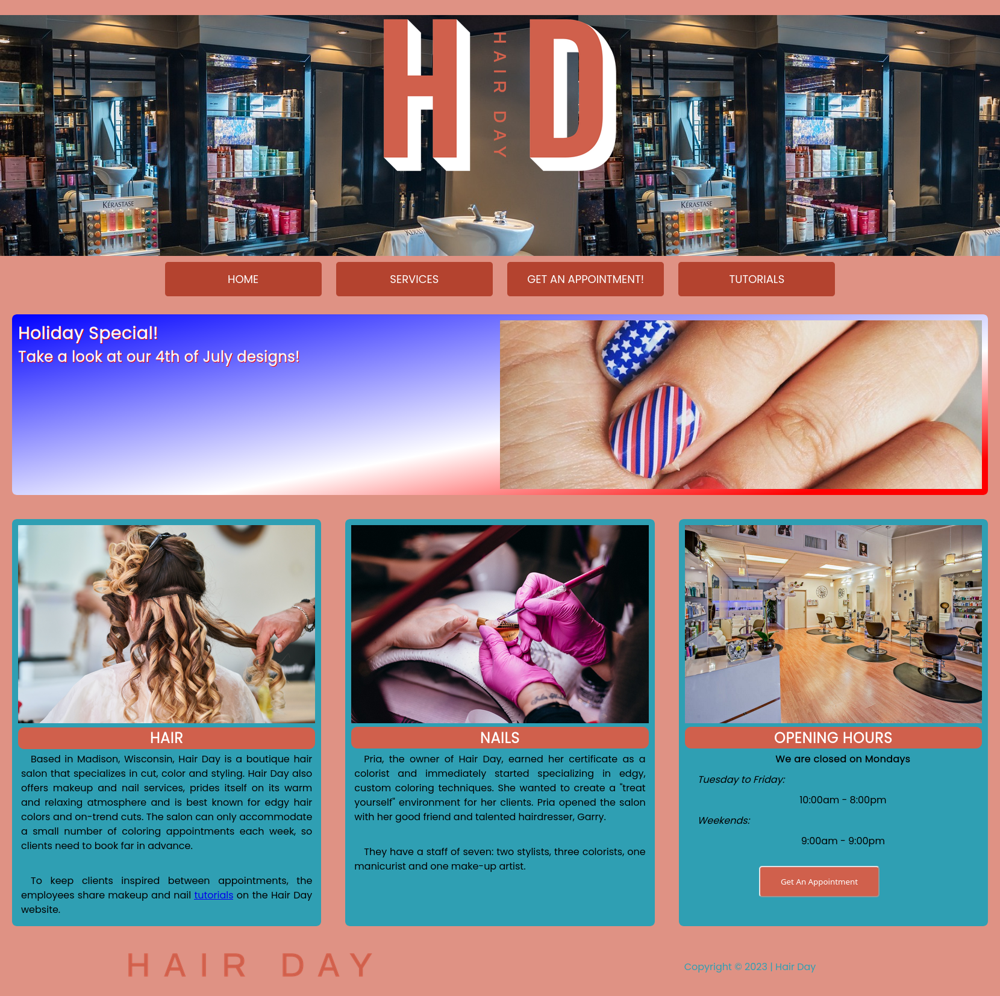

# Learning-Projects

Theese are various projects from learning sites such as freeCodeCamp, Odin Project, Coursera...

I just gathered them in a single repo to organize and keep.

## 01_Hair_Day

Just a static website for a made up company. Main goals were to learn;

- Visual layout, Semantic structure, CSS layout, CSS styling, CSS effects
- A pretty basic layout.

This one was from Coursera. 

## 03_FCC_Code_Examples

Simple JS code snippets to learn.

